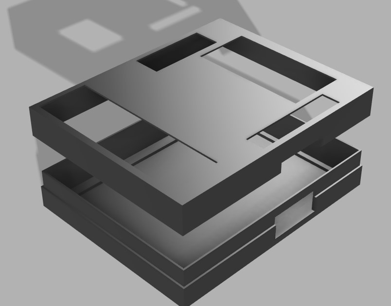

# CASA0016-Individual-Project
This is repo for casa0016 individual project


------------------


# CASA0016 - Individual Coursework

> **DIY Environmental Monitoring Station**
>
> Minghao Dec 2021


The Environmental monitoring system is designed to gather data locally and for indoor use.

***Electronic Desk Clock with environmental parameter monitor***


### GitHub repo

https://github.com/virgolibra/CASA0016-Individual-Project


### Prototype

Built on a stripboard, with solid wires and headers.


##### Front


##### Back


##### 3D-Printing Case

Designed a 3D-Printing Case model




### Deliverables

+ Sensor data measurements
  + Temperature
  + Humidity
  + Atmospheric pressure
  + Estimated Altitude
  + Air Quality in ppm (Parts Per Million)
  + UV (Ultraviolet) index
  + Sound detection (e.g. High volume)
+ Wi-Fi and MQTT server connection
+ Data collection and visualisation based on Raspberry pi, telegraf and Grafana platform.
+ Accurate local time display (GB Zone)
+ Prompt text and sensing data display on LCD 1602 module
+ A NeoPixel Stick used as the indicator lights
+ Two push buttons added as the user interaction (Change the display and set silent mode on and off)
+ A Buzzer used as the feedback from the button pressed and the successful MQTT data uploading.


### Data Collection and Visualisation

##### Serial Monitor


##### Serial Monitor

To MQTT Topic ```student/CASA0016/project/ucfnmz0```


##### Grafana


### Components

+ **Controller:** UNO WiFi Rev 2

  
  
+ **Outputs**

  + LCD 1602 Module
  
  
  
  + NeoPixel Stick
  
  
  
  + TM1637 4-digits display
  
  
  
  + Low level trigger buzzer
  
  

+ **Inputs**

  + DHT11 Temperature and humidity sensor

  

  + SENS 43 analog UV sensor

   

  + BMP180 Barometric pressure sensor

  

  + MQ-135 Air quality sensor

  

  + TS-YM-115 Sound Sensor

  

  + Push buttons

  


### Pin Connection

##### Arduino Wifi Board Pinout


##### Components Connection

| LCD 1602 | Arduino |
| -------- | ------- |
| RS       | 2       |
| EN       | 4       |
| D4       | 8       |
| D5       | 9       |
| D6       | 10      |
| D7       | 11      |

| NeoPixel | Arduino |
| -------- | ------- |
| DIN      | 6       |

| TM1637 | Arduino |
| ------ | ------- |
| CLK    | 12      |
| DIO    | 13      |

| Buzzer | Arduino |
| ------ | ------- |
| I/O    | 5       |

| DHT11 | Arduino |
| ----- | ------- |
| S     | 3       |

| TS-YM-115 | Arduino |
| --------- | ------- |
| OUT       | 7       |

| MQ-135 | Arduino |
| ------ | ------- |
| AO     | A1      |

| BMP180 | Arduino   |
| ------ | --------- |
| SCL    | SCL (D19) |
| SDA    | SDA (D18) |

| UV Sensor | Arduino |
| --------- | ------- |
| OUT       | A3      |

|              | Arduino  |
| ------------ | -------- |
| **Button 1** | D14 (A0) |
| **Button 2** | D16 (A2) |


#### BMP 180 Module

> Temperature, Pressure and Altitude

https://lastminuteengineers.com/bmp180-arduino-tutorial/

https://create.arduino.cc/projecthub/electropeak/determining-the-pressure-and-altitude-using-gy-68-bmp180-and-93fd6f


+ Operating Voltage 3.3 V. With a built-in 3.3 regulator, the module can be connected to 5 V power supply.
+ I2C Communication (SCL - SCL, SDA - SDA)
+ Output: Temperature, pressure and altitude.
+ Test Sketch: ```bmpTest.ino``` to read sensor data and print in the serial monitor.

Serial Monitor Output


**Improvements:** The calculation of altitude is based on the measured pressure. The pressure on the sea level can affect the accuracy of estimated altitude. (1 hectopascal (hPa) - 8.5 m). The pressure at sea level is set to 1013.25 hPa as default, which could be updated in real time to get more accurate results.


#### Buzzer

> Low level trigger buzzer

https://www.arduino.cc/reference/en/language/functions/advanced-io/tone/


+ Operating Voltage: 5 V

+ GPIO (I/O - Pin 5)

+ Test Sketch: ```buzzerTest.ino``` to generate 1 kHz sound every 2 seconds.

   

#### LCD 1602

> Display prompt text and measured values.


+ Operating Voltage: 5 V
+ Communication (RS - 2, EN - 4, D4 - 8, D5 - 9, D6 - 10, D7 - 11)
+ Test Sketch: ```lcdTest.ino``` to test LCD displaying function and scroll the text.


#### TM1637 4-Digit Display

> Used as a desk clock to display the time


+ Operating Voltage: 5 V
+ Communication (CLK - 12, DIO - 13)
+ Test Sketch: ```tm1637Test.ino``` to test time display


#### MQ-135 Module

> Measure gas ppm

[GitHub - Phoenix1747/MQ135: 📚🌀 Arduino library for the MQ135 air quality sensor. Allows for temperature and humidity corrected readings.](https://github.com/Phoenix1747/MQ135)

https://www.kane.co.uk/knowledge-centre/what-are-safe-levels-of-co-and-co2-in-rooms

